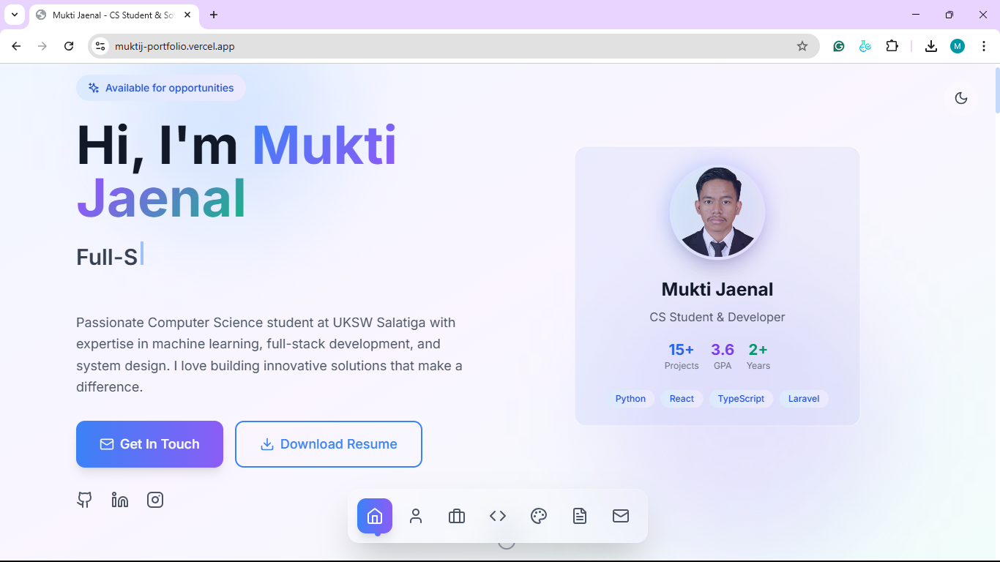

# 🚀 Mukti Jaenal - Portfolio Website

A modern, responsive portfolio website showcasing my journey as a Computer Science student and aspiring software engineer. Built with cutting-edge web technologies and featuring smooth animations, dark mode support, and a fully functional contact system.



## ✨ Features

### 🎨 **Modern Design & User Experience**
- **Responsive Design** - Seamless experience across all device sizes
- **Dark/Light Mode** - Toggle between themes with smooth transitions
- **Smooth Animations** - Powered by Framer Motion for delightful interactions
- **Glass Morphism Effects** - Modern UI with backdrop blur and transparency
- **Interactive Elements** - 3D card tilts, hover effects, and micro-interactions

### 📧 **Advanced Contact System**
- **Real Email Functionality** - Powered by EmailJS for reliable message delivery
- **Auto-Reply Feature** - Professional confirmation emails sent to visitors
- **Form Validation** - Client-side validation with user-friendly error messages
- **Success/Error States** - Clear feedback for all form interactions
- **Anti-Spam Protection** - Environment-based configuration for security

### 🔧 **Technical Features**
- **TypeScript** - Type-safe development with enhanced developer experience
- **Modern React** - Built with React 18 and functional components with hooks
- **Performance Optimized** - Code splitting, lazy loading, and optimized builds
- **SEO Optimized** - Meta tags, Open Graph, and Twitter Card support
- **Accessibility** - WCAG compliant with semantic HTML and ARIA labels

### 📱 **Sections & Content**
- **Hero Section** - Dynamic typing animation and engaging introduction
- **About Me** - Personal journey and technical interests
- **Projects** - Interactive project showcase with live demos and GitHub links
- **Skills** - Visual representation of technical competencies
- **Experience** - Professional and organizational experience timeline
- **Contact** - Fully functional contact form with auto-reply system

## 🛠️ Tech Stack

### **Frontend Framework & Libraries**
- **React 18.3.1** - Modern React with hooks and functional components
- **TypeScript 5.5.3** - Type-safe JavaScript with enhanced developer experience
- **Vite 6.3.5** - Lightning-fast build tool and development server

### **Styling & UI**
- **Tailwind CSS 3.4.1** - Utility-first CSS framework for rapid UI development
- **Framer Motion 10.16.16** - Production-ready motion library for React
- **Lucide React 0.344.0** - Beautiful, customizable SVG icons
- **Custom Glass Morphism** - Modern UI effects with backdrop blur

### **Functionality & Integrations**
- **EmailJS** - Client-side email service for contact form functionality
- **React Intersection Observer 9.5.3** - Trigger animations on scroll
- **Environment Variables** - Secure configuration management

### **Development Tools**
- **ESLint 9.9.1** - Code linting with TypeScript and React plugins
- **TypeScript ESLint 8.3.0** - TypeScript-specific linting rules
- **PostCSS 8.4.35** - CSS processing with Autoprefixer
- **Autoprefixer 10.4.18** - Vendor prefix automation

## 🚀 Getting Started

### Prerequisites
- Node.js (v16 or higher)
- npm or yarn package manager

### Installation

1. **Clone the repository**
   ```bash
   git clone https://github.com/Mukti-J/Web_Portfolio.git
   cd Web_Portfolio
   ```

2. **Install dependencies**
   ```bash
   npm install
   ```

3. **Set up environment variables**
   ```bash
   cp .env.example .env
   ```
   
   Fill in your EmailJS credentials in the `.env` file:
   ```env
   VITE_EMAILJS_SERVICE_ID=your_service_id_here
   VITE_EMAILJS_TEMPLATE_ID=your_template_id_here
   VITE_EMAILJS_AUTOREPLY_TEMPLATE_ID=your_autoreply_template_id_here
   VITE_EMAILJS_PUBLIC_KEY=your_public_key_here
   ```

4. **Start the development server**
   ```bash
   npm run dev
   ```

5. **Open your browser**
   Navigate to `http://localhost:5173` to see the portfolio in action!

## 📧 EmailJS Setup

To enable the contact form functionality, you'll need to set up EmailJS:

1. **Create an account** at [EmailJS.com](https://emailjs.com/)
2. **Set up an email service** (Gmail, Outlook, etc.)
3. **Create email templates** for both main emails and auto-replies
4. **Get your credentials** and add them to your `.env` file

For detailed setup instructions, see [EMAIL_SETUP.md](EMAIL_SETUP.md).

## 🔨 Available Scripts

```bash
# Start development server
npm run dev

# Build for production
npm run build

# Preview production build
npm run preview

# Run linting
npm run lint
```

## 📂 Project Structure

```
src/
├── components/
│   ├── sections/          # Main page sections
│   │   ├── Hero.tsx       # Hero section with typing animation
│   │   ├── About.tsx      # About me section
│   │   ├── Projects.tsx   # Projects showcase
│   │   ├── Skills.tsx     # Skills with 3D card effects
│   │   ├── Experience.tsx # Experience timeline
│   │   └── Contact.tsx    # Contact form with EmailJS
│   └── ui/                # Reusable UI components
│       ├── Button.tsx     # Custom button component
│       ├── Card.tsx       # Glass morphism cards
│       ├── SkillBar.tsx   # Animated skill bars
│       └── ThemeToggle.tsx# Dark/light mode toggle
├── hooks/
│   └── useTheme.ts        # Theme management hook
├── modules/
│   └── theme.ts           # Theme logic and persistence
├── App.tsx                # Main app component
├── main.tsx              # App entry point
└── index.css             # Global styles and Tailwind imports
```

## 🎨 Customization

### **Colors & Theming**
- Modify `tailwind.config.js` for custom color schemes
- Update CSS custom properties in `index.css`
- Customize theme logic in `src/modules/theme.ts`

### **Content**
- Update personal information in each section component
- Replace project data in `Projects.tsx`
- Modify skill sets in `Skills.tsx`
- Update experience timeline in `Experience.tsx`

### **Animations**
- Customize Framer Motion variants in component files
- Adjust timing and easing in animation configurations
- Add new animations using the Framer Motion API

## 🌐 SEO & Performance

- **Meta Tags** - Comprehensive meta tags for social sharing
- **Open Graph** - Facebook and LinkedIn preview optimization
- **Twitter Cards** - Enhanced Twitter sharing experience
- **Performance** - Optimized images, code splitting, and lazy loading
- **Lighthouse Score** - Optimized for 90+ scores across all metrics

## 📱 Browser Support

- ✅ Chrome (90+)
- ✅ Firefox (88+)
- ✅ Safari (14+)
- ✅ Edge (90+)
- ✅ Mobile browsers (iOS Safari, Chrome Mobile)

## 🤝 Contributing

While this is a personal portfolio, I welcome suggestions and improvements!

1. Fork the repository
2. Create a feature branch (`git checkout -b feature/amazing-feature`)
3. Commit your changes (`git commit -m 'Add amazing feature'`)
4. Push to the branch (`git push origin feature/amazing-feature`)
5. Open a Pull Request

## 📄 License

This project is licensed under the MIT License - see the [LICENSE](LICENSE) file for details.

## 📞 Contact

**Mukti Jaenal**
- 📧 Email: [672023266@student.uksw.edu](mailto:672023266@student.uksw.edu)
- 🐙 GitHub: [@Mukti-J](https://github.com/Mukti-J)
- 💼 LinkedIn: [muktijaenal](https://www.linkedin.com/in/muktijaenal/)
- 📱 Instagram: [@mukti.xj7](https://www.instagram.com/mukti.xj7/)

---

## 🚀 Deployment

This portfolio is optimized for deployment on:

- **Vercel** (Recommended) - Zero-config deployment with automatic HTTPS
- **Netlify** - Static site hosting with form handling
- **GitHub Pages** - Free hosting for static sites
- **Railway** - Full-stack deployment with backend support

### Vercel Deployment

1. Push your code to GitHub
2. Connect your repository to Vercel
3. Add environment variables in Vercel dashboard
4. Deploy automatically on every push

### Environment Variables for Production

Make sure to add these environment variables in your hosting platform:

```
VITE_EMAILJS_SERVICE_ID
VITE_EMAILJS_TEMPLATE_ID
VITE_EMAILJS_AUTOREPLY_TEMPLATE_ID
VITE_EMAILJS_PUBLIC_KEY
```

---

**Built with ❤️ by Mukti Jaenal**

*Creating digital experiences that inspire and engage.*
